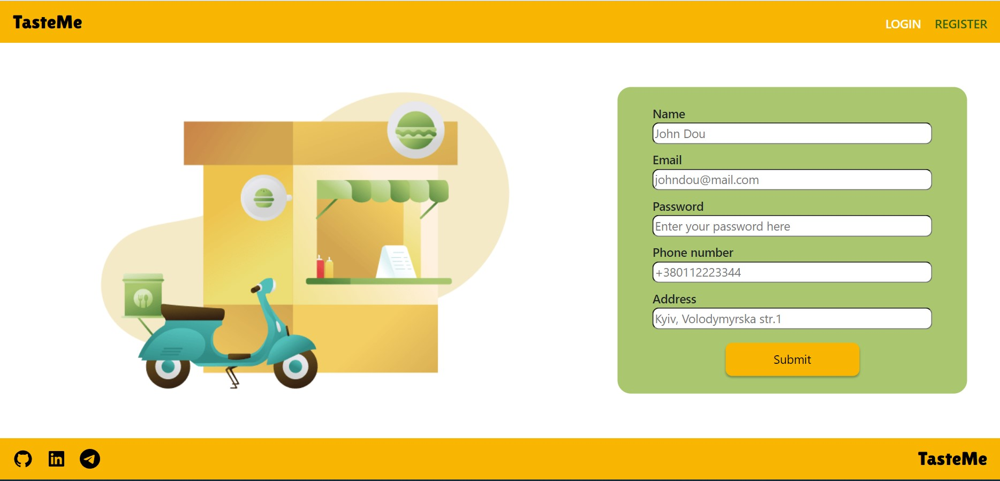
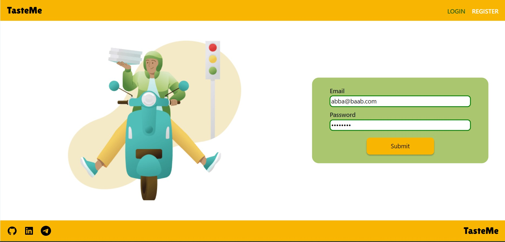
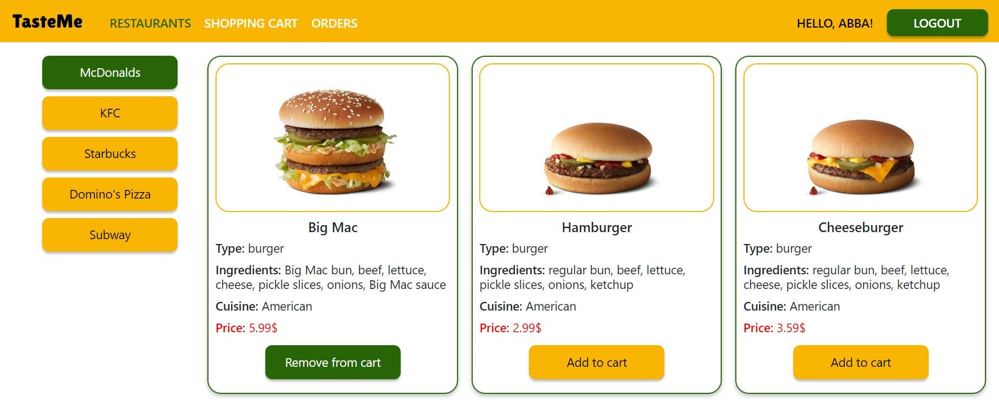
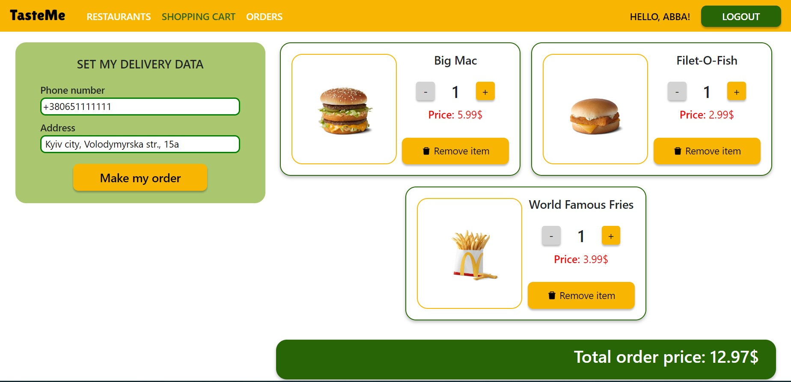
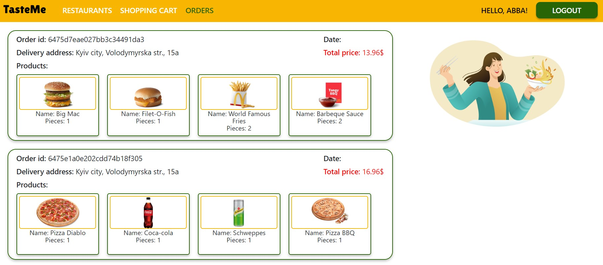

# TasteMe Delivery App

This is a non-adaptive delivery web App intended to help people make food orders
via Internet. It allows choose foods from various restaurants, add them to the
shopping cart, correct curent order and personal delivery data and track orders'
history.

Homepage:

## Authorisation

First visit to the TasteMe app should start with the user registration.

The registered users should use login page to enter their personal account.

## Restaurants page

After successful auth process user is redirected to the restaurants page.

Left side menu here is a list of restaurants, that allows user to choose foods
and drinks from the restaurants' delivery menu.

Menu is presented by the list of product cards, each contains a product info,
namely a name, picture, ingredients list, cusisne type and price.

Add button indicated at the end of the product card allows to add product to the
shopping cart or remove it from there.

## Shopping cart page

Shopping cart page allows user to correct current order.

Here user can set delivery address and contact phone. Data from the user profile
are indicated by default, but one can indicate specific data for the current
delivery.

Order menu is presented by choosen products' cards, where user can change the
number of items selected for the delivery.

Bottom indicator will calculate the total order price.

## Orders page

This page conteins orders history. 

Here user cant track info about all the orders made. This info includes order
id, delivery data and address, set of ordered foods and order total price.

## Technology stack

TasteMe App was build using indicated tech stack:

	<code></code>
	<code></code>
	<code></code>
	<code></code>
	<code></code>
	<code></code>
 	<code></code>
	<code></code>
	<code></code>
	<code></code>
    <code></code>

